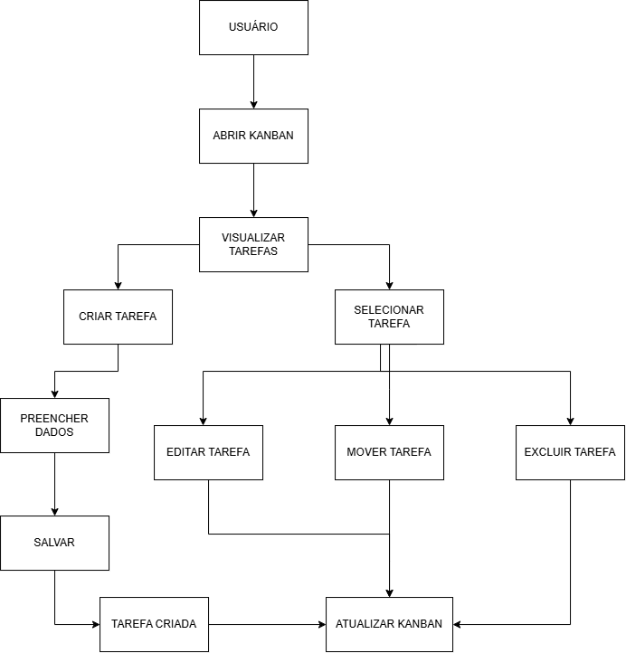

# Mini Kanban de Tarefas

Desafio Fullstack desenvolvido para a Veritas Consultoria Empresarial.

Aplicação Kanban com três colunas fixas para gerenciamento de tarefas, utilizando React no frontend e Go no backend com API REST.

---

## Tecnologias utilizadas

### Frontend

* React
* Vite
* JavaScript
* CSS

### Backend

* Go
* Gorilla Mux
* API REST

---

## Funcionalidades

* Criar tarefas com título e descrição
* Visualizar tarefas separadas por status
* Mover tarefas entre colunas:

  * A Fazer
  * Em Progresso
  * Concluídas
* Editar tarefas
* Excluir tarefas
* Validação de título obrigatório
* Validação de status permitido
* Comunicação entre frontend e backend via API REST

---

# Como executar o projeto

## Backend

Entre na pasta:

```bash
cd backend
```

---

## User Flow

Fluxo das principais ações do usuário no sistema:



## Decisões técnicas

O frontend foi desenvolvido utilizando React e Vite, consumindo uma API REST desenvolvida em Go.

O backend utiliza armazenamento em memória para gerenciamento das tarefas, conforme permitido no escopo do desafio. A comunicação entre frontend e backend é realizada através de requisições HTTP utilizando os métodos REST (GET, POST, PUT e DELETE).

---

## Limitações conhecidas e melhorias futuras

Atualmente as tarefas são armazenadas em memória e são perdidas quando o servidor backend é reiniciado.

Como melhoria futura, seria possível implementar persistência em arquivo JSON ou banco de dados para manter os dados salvos permanentemente.

Outras melhorias possíveis:
- Implementação de testes automatizados;
- Drag and drop para movimentação das tarefas;
- Melhorias de acessibilidade e feedbacks visuais.